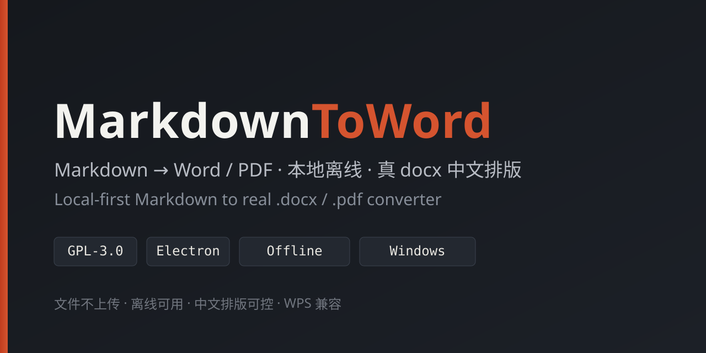
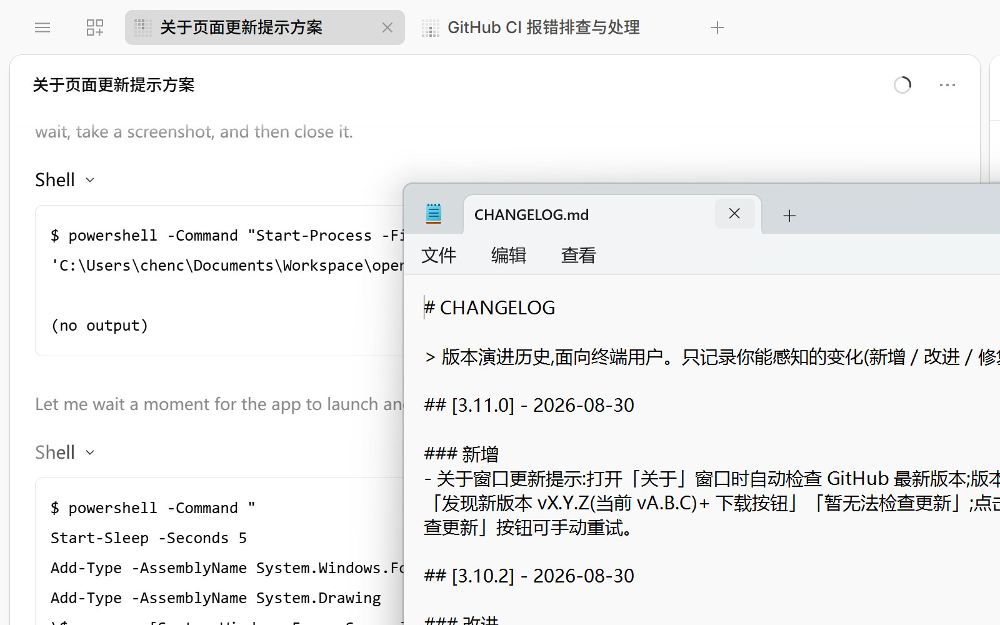
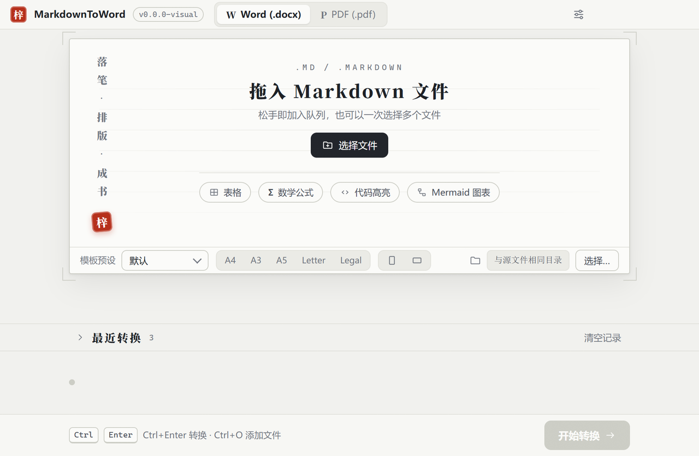
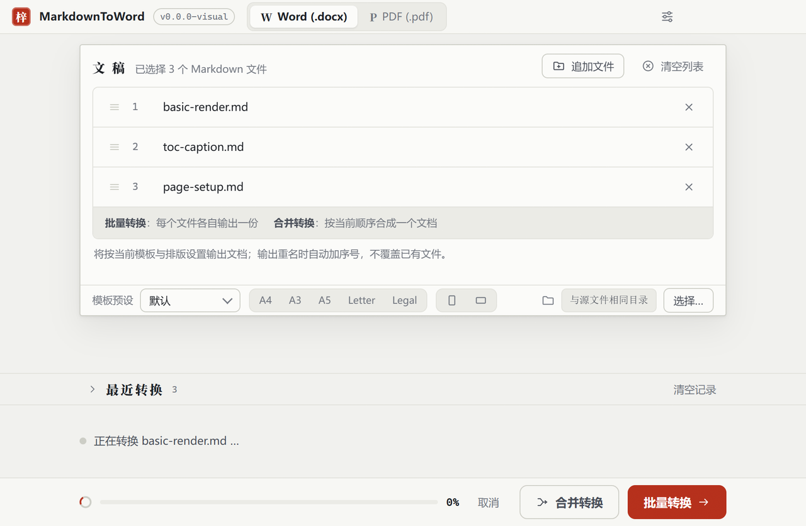

<p align="center">
  
</p>

<p align="center">
  <a href="https://github.com/chenchaodev/markdown-to-word/actions/workflows/ci.yml"></a>
  <a href="https://github.com/chenchaodev/markdown-to-word/releases/latest"></a>
  <a href="https://github.com/chenchaodev/markdown-to-word/releases"></a>
  
  
</p>

<p align="center">
  <a href="README.md">中文</a>
</p>

---

A Windows desktop app that converts Markdown to Word / PDF. Conversion runs **locally** — your files are never uploaded and it works fully offline. It produces **real Word documents** (not HTML renamed to .docx) with controllable Chinese typesetting.

### Download

No environment setup needed for end users — just grab the installer:

> **[Download the latest installer (MarkdownToWord-Setup-x.exe)](https://github.com/chenchaodev/markdown-to-word/releases/latest)**

The installer is wizard-based and lets you choose the install directory. It supports single-file, batch, and merge modes; existing outputs are auto-renamed (never overwritten).

To build from source, see **Quick start** below.

### Features

- **Convert**: consistent Word (.docx) / PDF (.pdf) rendering; single / batch / merge modes; auto-suffix on name clash
- **Layout**: Chinese fonts, sizes, line spacing & indentation; paper margins & orientation; auto-numbered headings / captions / equations; TOC, cover, header/footer/page numbers
- **Syntax**: full GFM (task lists / strikethrough), footnotes, comments, Mermaid diagrams, code highlighting, inline-HTML allowlist, `<!-- page-break -->` page breaks
- **Academic**: numbered equations (OMML/KaTeX) with cross-references; figure/table/section cross-reference jumps
- **UX**: dark mode (3-state), multi-language UI (registry-driven, progressively extensible), template presets (JSON import/export), custom PDF CSS, live preview, recent conversions
- **Robust**: encoding compatibility (UTF-8/UTF-16/GBK), networked-image embedding (intranet blocked + size cap), actionable failure hints, zero network when offline

### Screenshots

<p align="center">
  
  <br><em>Main window: pick files → pick format → convert</em>
</p>

<p align="center">
  
  &nbsp;
  
  <br><em>Left: empty state　Right: recent conversions panel</em>
</p>

### Quick start (developers)

Requirements: Node.js >= 20.19 (in China, set the Electron mirror first — see [DEV-GUIDE](docs/DEV-GUIDE.md#环境): `ELECTRON_MIRROR` and `ELECTRON_BUILDER_BINARIES_MIRROR`)

```bash
npm install
npm run dev     # build + launch Electron
npm run dist    # package the Windows NSIS installer into release/
```

### Tech stack

- Electron 43 + Node.js >= 20.19 + TypeScript (ESM)
- docx 9.x (Word rendering) + remark (parsing)
- markdown-it 14.3 (PDF rendering) + Electron printToPDF
- pdf-lib (PDF bookmarks/metadata), KaTeX (math), Mermaid 11 (diagrams), highlight.js (code)

### Development

```bash
npm run typecheck    # TypeScript type check
npm run lint         # ESLint
npm run build        # build
npm run test         # acceptance tests (62 zero-registration segments)
npm run test:smoke   # Electron smoke test
npm run test:all     # acceptance + smoke
```

### Documentation

- [User Guide](docs/USER-GUIDE.md) · [Dev Guide](docs/DEV-GUIDE.md) · [Changelog](docs/CHANGELOG.md)
- [Roadmap](docs/ROADMAP.md) · [Acceptance](docs/ACCEPTANCE.md) · [Status](docs/STATUS.md)
- [Research](docs/RESEARCH.md) · [ADR](docs/ADR.md)

### License

[GPL-3.0](LICENSE) (GNU General Public License v3): free software; use, modify, and redistribute permitted, but derivative works must be released under the same license.
