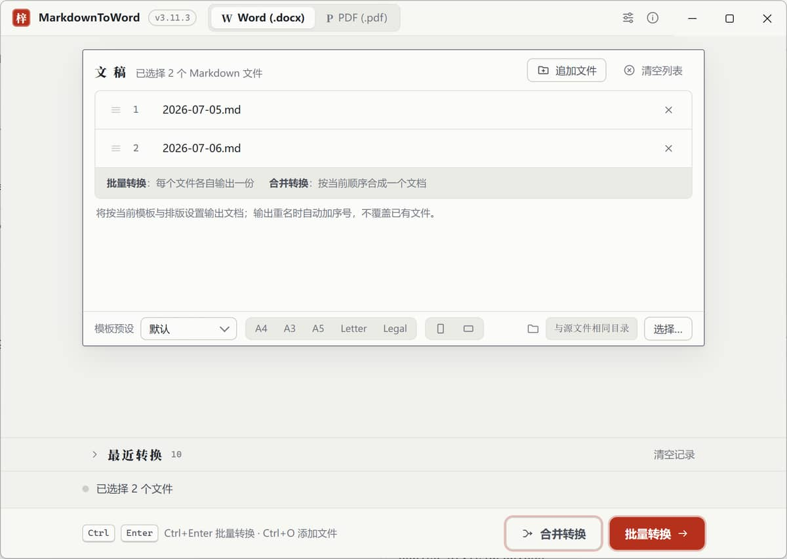
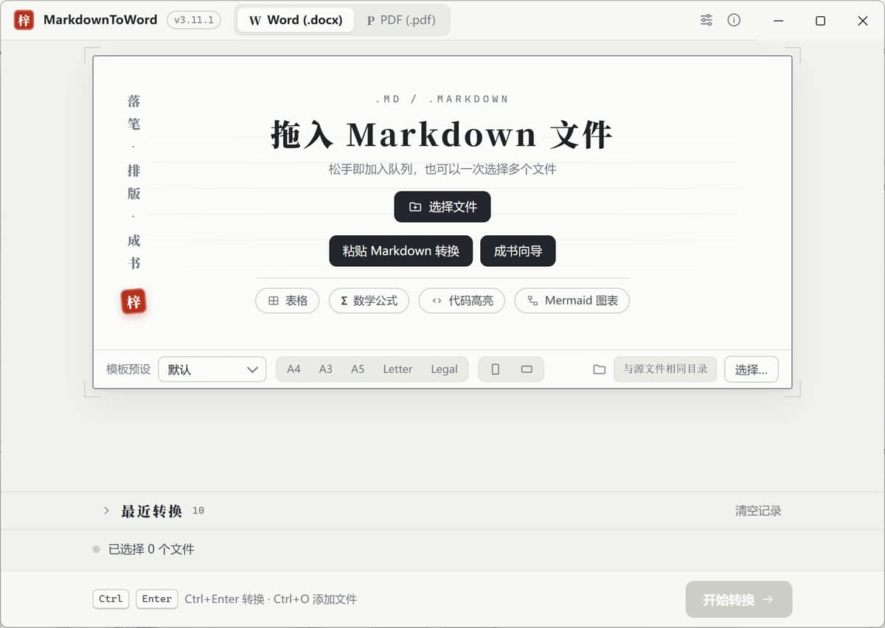
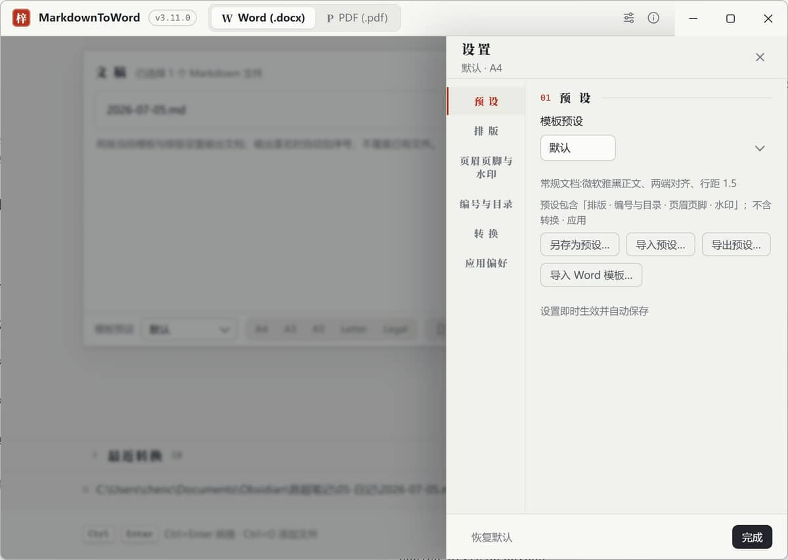

<p align="center">
  
</p>

<p align="center">
  <a href="https://github.com/chenchaodev/markdown-to-word/actions/workflows/ci.yml"></a>
  <a href="https://github.com/chenchaodev/markdown-to-word/releases/latest"></a>
  <a href="https://github.com/chenchaodev/markdown-to-word/releases"></a>
  
  
</p>

<p align="center">
  <a href="README.md">中文</a> · <a href="https://chenchaodev.github.io/markdown-to-word/">Website</a>
</p>

---

A Windows desktop app that converts Markdown to Word / PDF. Conversion runs **locally** — your files are never uploaded and it works fully offline. It produces **real Word documents** (not HTML renamed to .docx) with controllable Chinese typesetting.

### Download

No environment setup needed for end users — just grab the installer:

> **[Download the latest installer (MarkdownToWord-Setup-x.exe)](https://github.com/chenchaodev/markdown-to-word/releases/latest)**

The installer is wizard-based and lets you choose the install directory. It supports single-file, batch, and merge modes; existing outputs are auto-renamed (never overwritten).

### Features

#### Core Conversion

- **Dual-format output**: Consistent Word (.docx) / PDF (.pdf) rendering — what you see is what you get
- **Three modes**: Single file / batch (one document per file) / merge (multiple files into one document)
- **Clipboard convert**: "Paste Markdown to Convert" button on empty state — reads clipboard text directly; file paths are added to queue

#### Layout Control

- **Chinese fonts & sizes**: Independent settings for Western/Chinese fonts, body text 8-24pt
- **Line spacing & indentation**: 1.0-2.5x line height, first-line indent 2 characters
- **Page setup**: A4/A3/A5/Letter/Legal, portrait/landscape, margins 0-1000mm
- **TOC modes**: Static TOC (default) or Word field TOC (with real page numbers); PDF always has page numbers
- **Heading typography**: Title scaling/spacing three levels (compact/standard/relaxed), consistent between docx and PDF

#### Auto-numbering

- **Chapter numbering**: Headings auto-numbered as "1 / 1.1 / 1.1.1"
- **Caption numbering**: Figure/table auto-numbering (continuous across document)
- **Equation numbering**: Standalone equation blocks auto-numbered; inline equations not numbered

#### Academic Features

- **Math support**: Native OMML (docx) / KaTeX (PDF) rendering
- **Cross-references**: Equation/figure/table/section cross-reference jumps
- **Mermaid diagrams**: `mermaid` fenced code blocks rendered as diagrams (PNG in docx / SVG in PDF)

#### Book Wizard

Seven-step guided workflow that chains all features — no need to open settings:

1. **Template/Preset**: Choose built-in preset or import Word template
2. **Cover page**: Title/author from frontmatter or wizard input, generates independent cover
3. **Header/Footer**: Default/custom/none modes, supports logo and layout
4. **Watermark**: Text/rotation/opacity/light gray classic look
5. **Merge sources**: Select multiple Markdown files + sort, joined with page-breaks
6. **TOC/Page numbers**: Enable TOC + choose mode
7. **Output**: Single docx/pdf with cover page and complete table of contents

#### Smart Processing

- **AI cleanup pre-process**: Auto-normalizes smart quotes, em-dashes, list spacing and blank lines before conversion
- **Obsidian compatibility**: Auto-converts `[[wikilinks]]` / `![[embeds]]` to standard Markdown
- **Pre-conversion check**: Scans for missing images, dangling references, unlabeled code blocks
- **Encoding compatibility**: Auto-detects UTF-8/UTF-16/GBK — no manual handling needed

#### Template Presets

- **Built-in presets**: Default / Academic / Business / Official / Long-form / Minimal
- **Preset coverage**: Headers/footers/watermark/equation numbering/H1 page breaks
- **Import/Export**: JSON format for custom preset backup and sharing
- **Word template import**: Unpack .docx to extract fonts and page settings

#### User Experience

- **Responsive layout**: Minimum width 640, four breakpoints (comfortable/compact/narrow/short)
- **Dark mode**: Follow system / light / dark three-state toggle
- **Multi-language UI**: Chinese / English / Japanese
- **First-launch guide**: Onboarding path: pick preset → wizard → convert
- **Recent conversions**: Shows recent history, click to load / double-click to re-convert
- **Live preview**: Preview source before conversion, auto-refreshes with file changes
- **Update notification**: About window auto-checks GitHub for latest version

#### Reliability

- **Network images**: Auto-download and embed (intranet blocked + 20MB size cap)
- **Actionable error hints**: Clear error messages with suggested actions (file in use/missing/permissions)
- **Offline operation**: Zero network dependency, fully local conversion

### Screenshots

<p align="center">
  
  <br><em>Main window: pick files → pick format → convert</em>
</p>

<p align="center">
  
  &nbsp;
  
  <br><em>Left: empty state　Right: settings panel (6 tab groups)</em>
</p>

### Development and packaging

Requirements: Node.js >= 22.13. In China, set the Electron mirror first — see [DEV-GUIDE](docs/DEV-GUIDE.md).

```bash
npm install        # install dependencies
npm run dev        # build + launch Electron
npm run dist       # package the Windows NSIS installer into release/
```

Tech stack: Electron 43 + TypeScript (ESM); docx 9.x + remark (Word rendering), markdown-it 14.3 + Electron printToPDF (PDF rendering), KaTeX / Mermaid 11 / highlight.js / pdf-lib.

```bash
npm run typecheck    # TypeScript type check
npm run lint         # ESLint
npm run build        # build
npm run test         # acceptance tests (zero-registration, discovered by topic)
npm run test:smoke   # Electron smoke test
npm run test:all     # acceptance + smoke
```

Test system: Zero-registration acceptance tests organized by content topic in `test/`, in three layers: `segments` / `main` / `renderer`. Fixtures in `test/fixtures/`, output to `output/`. Segment count is whatever `npm run test` reports.

### Documentation

**For users**

- [User Guide](docs/USER-GUIDE.md): Installation, operations, settings, supported Markdown syntax, FAQ
- [Website](docs/index.html): Feature tour and download entry (GitHub Pages)
- [Changelog](docs/CHANGELOG.md): Version history
- [Compatibility matrix](docs/WPS-COMPAT.md): Word / WPS findings and the image-source boundary

**For developers**

- [Docs index](docs/README.md): Entry point for every doc, directory layout, capacity contracts
- [Dev Guide](docs/DEV-GUIDE.md): Environment, commands, code map, verification baseline
- [Roadmap and candidate pool](docs/ROADMAP.md): Single entry for requirements, scheduled work, numbering ledger
- [Acceptance matrix](docs/ACCEPTANCE.md): Acceptance checklists and test results
- [Status](docs/STATUS.md): Current status and open items
- [Research](docs/RESEARCH.md) / [ADR](docs/ADR.md): Technical findings and decisions
- [UI guidelines](docs/design/ui-guidelines.md) / [Settings IA](docs/design/settings-ia.md): Read before touching the UI

**Contributing**

- [Contributing](CONTRIBUTING.md) · [Security policy](SECURITY.md) · [Code of conduct](CODE_OF_CONDUCT.md)

### License

[GPL-3.0](LICENSE) (GNU General Public License v3): free software; use, modify, and redistribute permitted, but derivative works must be released under the same license.
