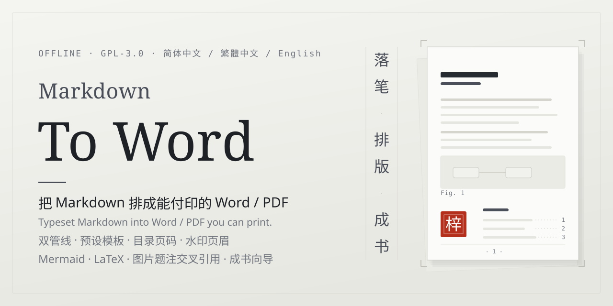
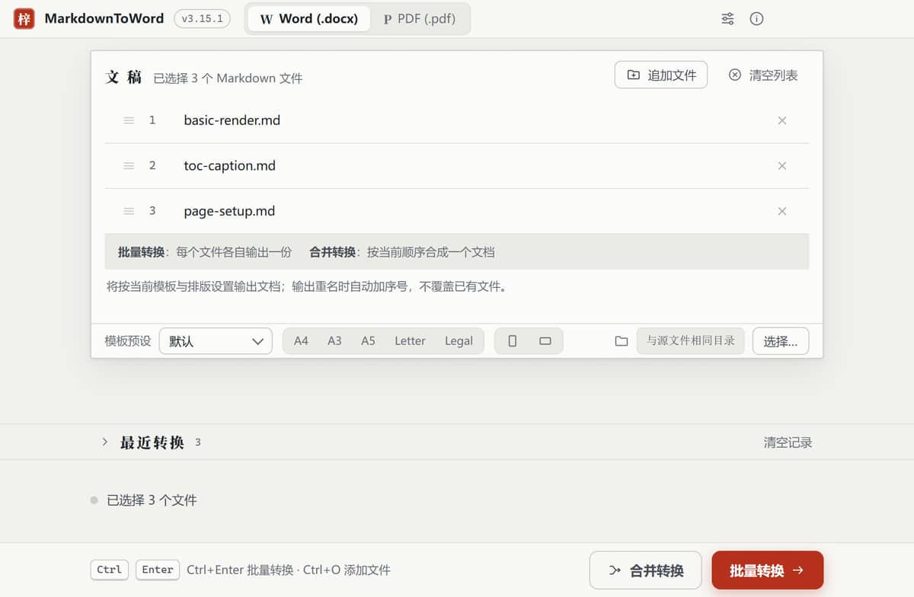
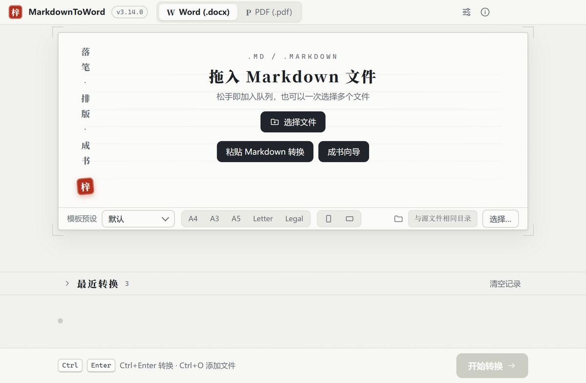
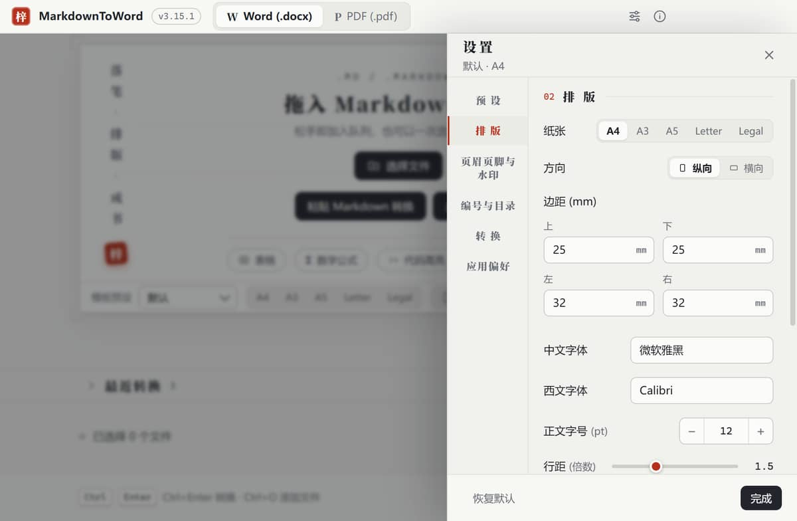
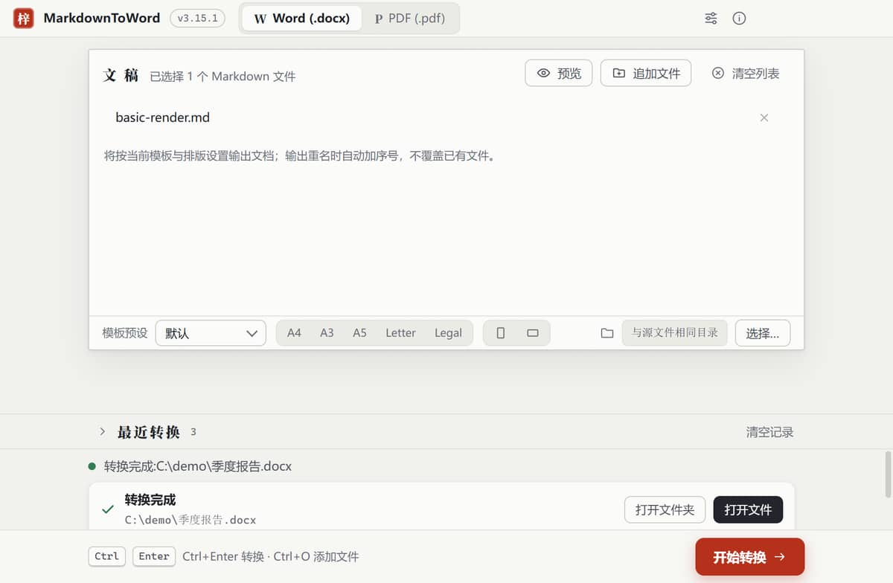
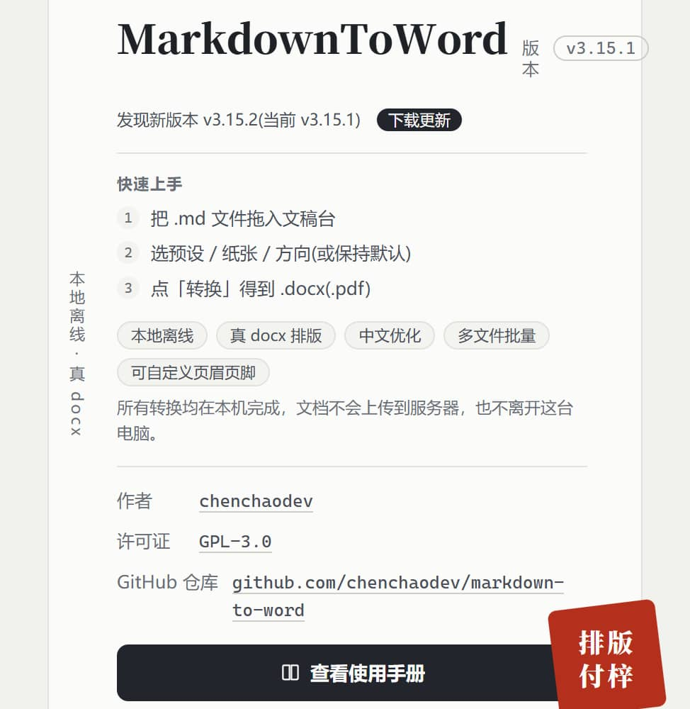

<p align="center">
  
</p>

<p align="center">
  <a href="https://github.com/chenchaodev/markdown-to-word/actions/workflows/ci.yml"></a>
  <a href="https://github.com/chenchaodev/markdown-to-word/releases/latest"></a>
  <a href="https://github.com/chenchaodev/markdown-to-word/releases"></a>
  
  
</p>

<p align="center">
  <a href="README.md">中文</a> · <a href="https://chenchaodev.github.io/markdown-to-word/">Website</a>
</p>

---

A Windows desktop app that converts Markdown to Word / PDF. Conversion runs **locally** — your files are never uploaded and it works fully offline. It produces **real Word documents** (not HTML renamed to .docx) with controllable Chinese typesetting.

### Download

No environment setup needed for end users — just grab the installer:

> **[Download the latest installer](https://github.com/chenchaodev/markdown-to-word/releases/latest)** — the file is named `MarkdownToWord-Setup-<version>.exe`

The installer is wizard-based and lets you choose the install directory. It installs for the current user, so **no administrator rights are needed**. Existing outputs are never overwritten — a duplicate output name gets a numeric suffix instead.

> The installer is not code-signed, so Windows may show an "Unknown publisher" or a SmartScreen "protected your PC" prompt the first time you run it. That is expected — go to "More info" → "Run anyway" to continue. Download only from the official Releases page linked above; the details are in [Installer signature status](docs/SIGNATURE-STATUS.md).

### Features

#### Core Conversion

- **Dual-format output**: Consistent Word (.docx) / PDF (.pdf) rendering — what you see is what you get
- **Three modes**: Single file / batch (one document per file) / merge (multiple files into one document)
- **Merge guard**: If any source file has an unclosed code fence, merging stops before it starts and names the file and the line to fix — after merging, the rest of that file *and every file after it* would collapse into a single code block. Single-file and batch conversion only warn and let you continue.
- **Clipboard convert**: "Paste Markdown to convert" button on empty state — reads clipboard text directly; file paths are added to queue

#### Layout Control

- **Chinese fonts & sizes**: Independent settings for Western/Chinese fonts, body size 8-24pt, line spacing 1.0-2.5x, plus a first-line indent switch that indents body paragraphs by 2 characters
- **Page setup**: A4/A3/A5/Letter/Legal, portrait/landscape, adjustable margins
- **TOC modes**: Static TOC (default) or Word field TOC (with real page numbers). PDF page numbers come from the footer template — turn the footer off and the PDF has none.
- **Heading typography**: Title scaling/spacing three levels (compact/standard/relaxed), consistent between docx and PDF

#### Auto-numbering

- **Chapter numbering**: Headings auto-numbered as "1 / 1.1 / 1.1.1"
- **Caption numbering**: Figure/table captions auto-numbered, with figures and tables counted in separate sequences. With chapter numbering on, captions are numbered per chapter (e.g. "图 1.1") and the sequence restarts at each top-level heading; with chapter numbering off (or no top-level heading at all) they simply run through the whole document. Figure labels and table labels also live in separate namespaces, so the same label can be used for both without one overwriting the other
- **Equation numbering**: Standalone equation blocks auto-numbered; inline equations not numbered

#### Academic Features

- **Math support**: Native OMML (docx) / KaTeX (PDF) rendering. Commands that pull in external links or images (`\href`, `\includegraphics`) are not written into the output — they are shown as source text.
- **Cross-references**: Equation/figure/table/section cross-reference jumps
- **Mermaid diagrams**: `mermaid` fenced code blocks rendered as diagrams (PNG in docx / SVG in PDF)

#### Book Wizard

A guided, step-by-step workflow that chains all features together — no need to open the settings panel:

1. **Template/Preset**: Choose built-in preset or import Word template
2. **Cover page**: Title/author from frontmatter or wizard input, generates independent cover
3. **Header/Footer**: Default/custom/none modes, supports logo and layout
4. **Watermark**: Text/rotation/opacity/light gray classic look
5. **Merge sources**: Select multiple Markdown files + sort, joined with page-breaks
6. **TOC/Page numbers**: Enable TOC + choose mode
7. **Output**: Single docx/pdf with cover page and complete table of contents

#### Smart Processing

- **AI cleanup**: Off by default; one master switch plus two tiers, both greyed out while the master switch is off:
  - *Conservative tidy*: normalize quotes and dashes, space out list markers, trim trailing spaces and extra blank lines — no content is changed
  - *Structural rewrite*: strip bare numeric citation markers (`[1]`, `【4】`), remove all emoji (including ZWJ sequences, skin-tone and flag variants), and rebalance heading levels — a document that starts at "second-level heading" gets shifted up a level and skipped levels are filled in
  - Text symbols such as `©` `®` `™` `✓` `§` `→`, plus footnotes, links, code blocks and inline code, are left untouched; switch off only the rewrite tier if you want to keep the text as written
- **Obsidian compatibility**: Auto-converts `[[wikilinks]]` / `![[embeds]]` to standard Markdown
- **Pre-conversion check**: Scans the source before conversion and reports what would otherwise be lost or mislaid out:
  - Missing local images, or relative image paths that point outside the document's folder
  - Dangling cross-references (a `#eq:` / `#sec:` / `#fig:` / `#tab:` target with no matching label)
  - Code blocks with no language tag (highlighting may be wrong)
  - ChatGPT-style `\(`…`\)` / `\[`…`\]` equation delimiters — only `$…$` and `$$…$$` are recognized, the others print as plain text
  - Block-level HTML outside the supported inline tag list (its content is dropped)
  - Unclosed code fences (reported with the line the fence starts on)
  - Unpaired `$` delimiters
  - Table-shaped lines that were not laid out as a table (missing delimiter row)
  - It runs for single-file conversion, batch conversion, Book Wizard publishing, clipboard convert and re-converting from recent history; when several files are checked at once, findings are grouped by file
- **Encoding compatibility**: Auto-detects UTF-8/UTF-16/GBK — no manual handling needed

#### Template Presets

- **Built-in presets**: Default / Academic paper / Business brief / Chinese official document / Chinese long-form / Chinese minimal (display names follow the UI language)
- **Preset coverage**: Headers/footers/watermark/equation numbering/H1 page breaks
- **Import/Export**: JSON format for custom preset backup and sharing
- **Word template import**: Unpack .docx to extract fonts and page settings

#### User Experience

- **Keyboard shortcuts**: `Ctrl+Enter` convert · `Ctrl+O` add files
- **Staged progress, cancellable**: Progress moves through the actual pipeline stages (read → parse → images → diagrams → equations → write), and a running conversion can be canceled
- **Output actions**: Open file / Open folder / Copy path, from the result dialogs and the summary bar
- **Responsive layout**: The window adapts down to its minimum width, reflowing at several breakpoints (comfortable/compact/narrow/short)
- **Dark mode**: Follow system / light / dark three-state toggle
- **Multi-language UI**: Chinese / English / Japanese
- **First-launch guide**: Onboarding path: pick preset → wizard → convert
- **Recent conversions**: Shows recent history; click an entry to load it back into the file list, and use the buttons at the end of the row to re-convert with the original format or open the source folder
- **Live preview**: Preview source before conversion, auto-refreshes with file changes
- **Update notification**: About window auto-checks GitHub for latest version

#### Reliability

- **Network images**: Auto-download and embed; private/loopback addresses are blocked and each image is capped at 20MB
- **Actionable error hints**: Clear error messages with suggested actions (file in use/missing/permissions)
- **Offline operation**: Zero network dependency, fully local conversion

### Screenshots

<p align="center">
  
  <br><em>Main window: pick files → pick format → convert</em>
</p>

<p align="center">
  
  &nbsp;
  
  <br><em>Left: empty state　Right: settings panel (grouped tabs)</em>
</p>

<p align="center">
  
  &nbsp;
  
  <br><em>Left: conversion complete (open file / open folder / copy path)　Right: about window (version and update check)</em>
</p>

### Development and packaging

Requirements: Node.js >= 22.13. In China, set the Electron mirror first — see [DEV-GUIDE](docs/DEV-GUIDE.md).

```bash
npm install        # install dependencies
npm run dev        # build + launch Electron
npm run dist       # package the Windows NSIS installer into release/
```

Tech stack: Electron 43 + TypeScript (ESM); docx 9.x + remark (Word rendering, with remark-gfm / remark-math), markdown-it 14.3 + Electron printToPDF (PDF rendering), KaTeX / Mermaid 11 / highlight.js / pdf-lib, jszip (unpacking .docx templates) and iconv-lite (GBK-compatible decoding).

```bash
npm run typecheck    # TypeScript type check
npm run lint         # ESLint
npm run build        # build
npm run test         # acceptance tests (zero-registration, discovered by topic)
npm run test:smoke   # Electron smoke test
npm run test:all     # acceptance + smoke
```

Test system: Zero-registration acceptance tests organized by content topic in `test/`, in three layers: `segments` / `main` / `renderer`. Fixtures in `test/fixtures/`, output to `output/`. Segment count is whatever `npm run test` reports.

### Documentation

**For users**

- [User Guide](docs/USER-GUIDE.md): Installation, operations, settings, supported Markdown syntax, FAQ
- [Website](docs/index.html): Feature tour and download entry (GitHub Pages)
- [Changelog](docs/CHANGELOG.md): Version history
- [Compatibility matrix](docs/WPS-COMPAT.md): Word / WPS findings and the image-source boundary

**For developers**

- [Work item ledger](docs/REQ.md): the single source for work item numbers and status
- [Work log](docs/LOG.md): wanted but not done (pending / deferred / rejected, with reasons)
- [Dev Guide](docs/DEV-GUIDE.md): Environment, commands, code map, verification baseline
- [Architecture decisions](docs/adr/): why it is designed this way (one decision per file)
- [UI guidelines](docs/design/ui-guidelines.md) / [Settings IA](docs/design/settings-ia.md): Read before touching the UI
- [Installer signature status](docs/SIGNATURE-STATUS.md): unsigned facts, risks and mitigations

**Contributing**

- [Contributing](CONTRIBUTING.md) · [Security policy](SECURITY.md) · [Code of conduct](CODE_OF_CONDUCT.md)

### Feedback and support

Bug reports, feature requests and questions go to [GitHub Issues](https://github.com/chenchaodev/markdown-to-word/issues). This app is built and maintained by [chenchaodev](https://github.com/chenchaodev) as a local, offline, Chinese-typesetting-focused Markdown converter.

### License

[GPL-3.0](LICENSE) (GNU General Public License v3): free software; use, modify, and redistribute permitted, but derivative works must be released under the same license.
