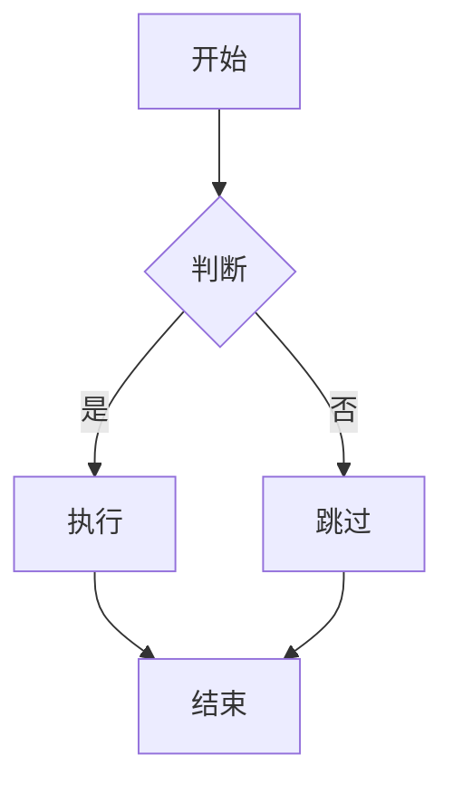

# Mermaid 失败原因可见性（手工验收样例）

> 用途：验证 2026-09-26 修复 —— Mermaid 渲染失败的原因此前**只进 console**，现经既有 warning 通道在 UI 可见。
> 预期：坏块转换后**不失败**（降级为代码原文），但**警告区能看到原因**；好块不产生任何警告。

## 1. 故意写坏的 Mermaid（关键观察点）

```mermaid
this is not valid mermaid syntax at all
```

上面这段应当：转换**整体成功**、该块**原样保留 mermaid 源码**、**警告区出现一条带原因的警告**（键为 `warn.mermaidFailed`，文案里应含失败原因，例如 parse 失败之类）。

## 2. 语法不完整的 Mermaid

```mermaid
graph TD
  A -->
```

同样应降级 + 警告区可见原因。

## 3. 正常 Mermaid（对照组：不得产生警告）



这段必须**无任何警告** —— 用来区分「原因真的可见了」与「所有 mermaid 都变成告警」。

## 4. 正常 LaTeX 公式（对照组：Mermaid 改动不应波及公式）

行内 $E = mc^2$ 与独立公式：

$$
\int_0^1 x^2 \, dx = \frac{1}{3}
$$

公式应正常渲染，**不出现任何 mermaid 相关警告**。

## 判定标准

| 现象 | 期望 |
|---|---|
| 第 1、2 节 | 转换成功；源码原样保留；**警告区可见失败原因** |
| 第 3 节 | 正常渲染，**零警告** |
| 第 4 节 | 正常渲染，**零 mermaid 警告** |
| 整体 | 转换**不应因 mermaid 失败而报错**（是降级，不是失败） |

docx 与 pdf 两种导出都要看。
